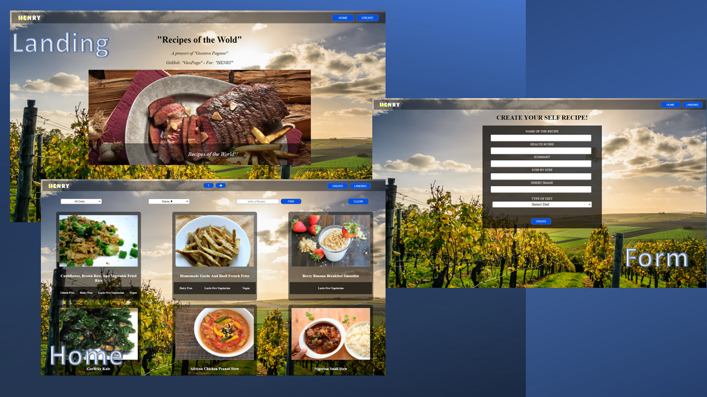
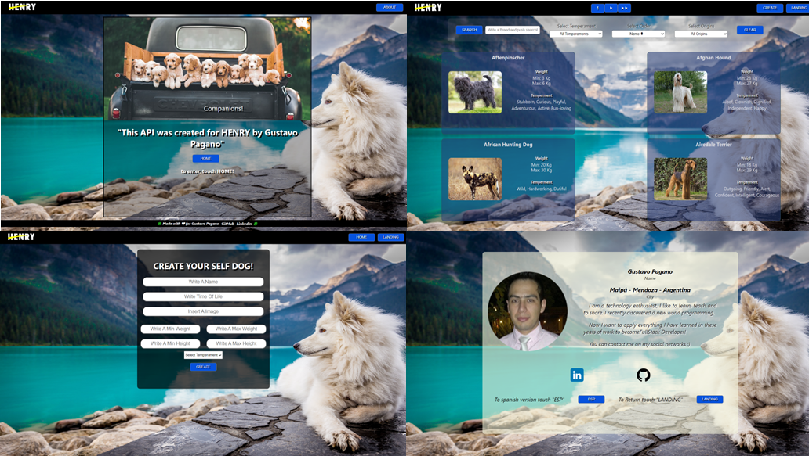

<h1 align="center">👋 Hi there, I´m Gustavo!!</h1>
<br/>
<h2 align="center">I´m a Full Stack developer from Argentina 🌎 !!</h2>
<br/>

## 🙋‍♂️ About Me

    ⚡I am a technology enthusiast, I like to learn, teach and to

    share. I recently discovered a new world programming.

    Now I want to apply everything I have learned in these years of

    work to become FullStack Developer!

<br/>
<br/>

<h1 align="center">Proyects</h1>
<br/>


## Portfolio
### 🌎 [Deploy](https://gap-portfolio.vercel.app) || 📺 [YouTube](https://www.youtube.com/watch?v=fXFi3BNHOiQ)
    👉 This is my Virtual-Cv, in this project, I show several of my projects and tell the technologies used to create them, I also apply everything I learned in the       bootstrap course, adding modals, badges, buttons, carousel, navbar and footer.


<br/>


## Cake&Bases
### 🌎 [Deploy](https://cakes-and-bases.vercel.app/) || 📺 [YouTube](https://youtu.be/eyvWmnxu6-8)
    👉This is the final project for "Soy Henry", 
    in this project we worked with 6 colleagues applying agile methodologies "SCRUM",
    dividing tasks and finally collaborating to reach the completion of the project.
<br/>

#### 👉In this proyect we use diferent libraries such as:

<details>
<summary>Click to 👁️</summary>
<p>

```
|------------|--------------|------------|--------------|-------------|---------------------------|
|   Backend  |   Frontend   |   Images   |  Send emails |  Payment    | Authentication-Loguin     |
|------------|--------------|------------|--------------|-------------|---------------------------|
|-Sequelize  |-React        |-Cloudinary |-Nodemailer   |-Mercado Pago|-Firebase Authentication   |
|-PostgreSQL |-Redux        |-imgbb      |              |             |-Firebase Firestore        |
|            |-React Admin  |            |              |             |                           |
|            |-React Graph  |            |              |             |                           |
|            |-Bootstrap    |            |              |             |                           |
|            |-Tailwind css |            |              |             |                           |
|------------|--------------|------------|--------------|-------------|---------------------------|

```

</p>
</details>
<br/>


<br/>

## "Foods"
### 💻 [GitHub](https://github.com/GusPaga/PI-Food)
#### 👉In this project, I learned how to modularize my code, I improved the use of Css

<br/>

## "Dogs"
### 💻 [GitHub](https://github.com/GusPaga/pi-dog) || 🌎 [Deploy](https://pi-dog-guspaga.vercel.app/) || 📺 [YouTube](https://youtu.be/OLm4yT3UddE)
#### 👉in this project, I understood the GitHub flow, achieving several improvements in the code

<br/>

<h3 align="center">My Hobbies</h3>
<h4 align="center">🏃Runnig || 📷 Fotograph || 🚗 Mechanic<h4>
<br/>

<h3 align="center">💌 Contact me:</h3>
<h4 align="center">
🔗<a href="https://www.linkedin.com/in/gustavopagano03" target="_blank">LinkedIn</a> || 📧<a href="mailto:gustavopagano03@gmail.com">Mail</a></h4>
<br/>
