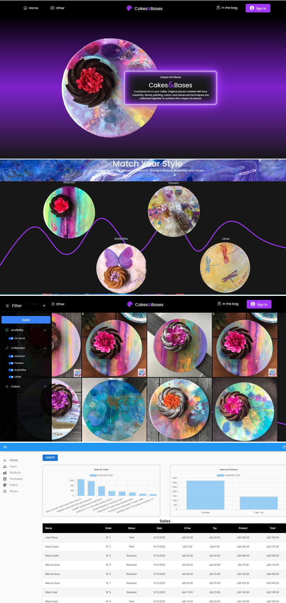
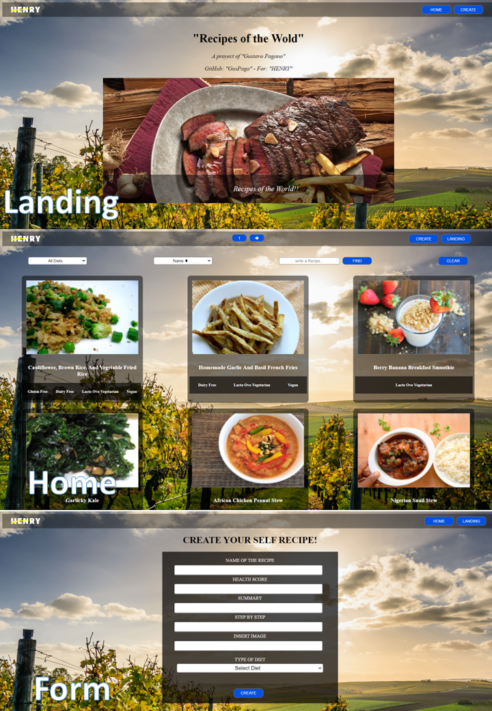

<h1 align="center">👋 Hi there, I´m Gustavo!!</h1>
<br/>
<h2 align="center">I´m a Full Stack developer from Argentina 🌎 !!</h2>
<br/>

## 🙋‍♂️ About Me

    ⚡I am a technology enthusiast, I like to learn, teach and to

    share. I recently discovered a new world programming.

    Now I want to apply everything I have learned in these years of

    work to becomeFullStack Developer!

<br/>
<br/>

## 🗂️ Highlight Projects

### 💻 [Cake&Bases](https://cakes-and-bases.vercel.app/)
    👉This is the final project for "Soy Henry", in this project we worked with 6 colleagues applying agile methodologies "SCRUM",
    dividing tasks and finally collaborating to reach the completion of the project.
<br/>

#### 👉In this proyect we use diferent libraries such as:

<details>
<summary>Click to 👁️</summary>
<p>

```
|------------|--------------|------------|--------------|-------------|---------------------------|
|   Backend  |   Frontend   |   Images   |  Send emails |  Payment    | Authentication-Loguin     |
|------------|--------------|------------|--------------|-------------|---------------------------|
|-Sequelize  |-React        |-Cloudinary |-Nodemailer   |-Mercado Pago|-Firebase Authentication   |
|-PostgreSQL |-Redux        |-imgbb      |              |             |-Firebase Firestore        |
|            |-React Admin  |            |              |             |                           |
|            |-React Graph  |            |              |             |                           |
|            |-Bootstrap    |            |              |             |                           |
|            |-Tailwind css |            |              |             |                           |
|------------|--------------|------------|--------------|-------------|---------------------------|

```

</p>
</details>
<br/>


<br/>

### 💻 [Foods](https://github.com/GusPaga/PI-Food)
#### 👉In this project, I learned how to modularize my code, I improved the use of Css

<br/>

### 💻 [Foods](https://github.com/GusPaga/pi-dog)
### 🌎 [Foods](https://pi-dog-guspaga.vercel.app/)
#### 👉in this project, I understood the GitHub flow, achieving several improvements in the code

<br/>

💌 Contact me:

### 💻 [linkedin](https://www.linkedin.com/in/gustavopagano03)

### 📧 [E-Mail](mailto:gustavopagano03@gmail.com)
